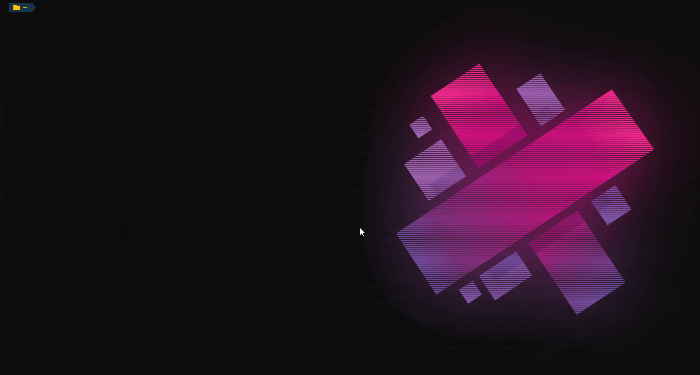
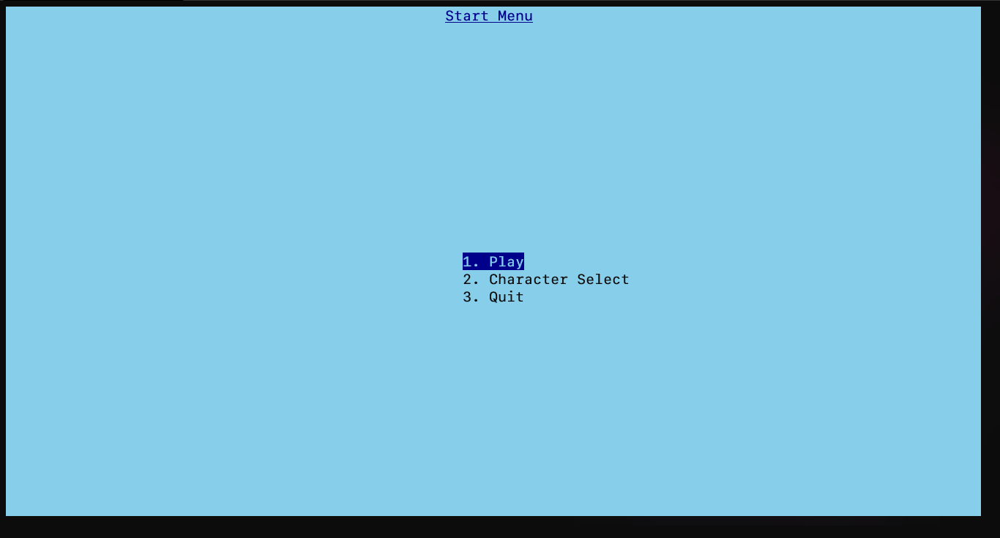
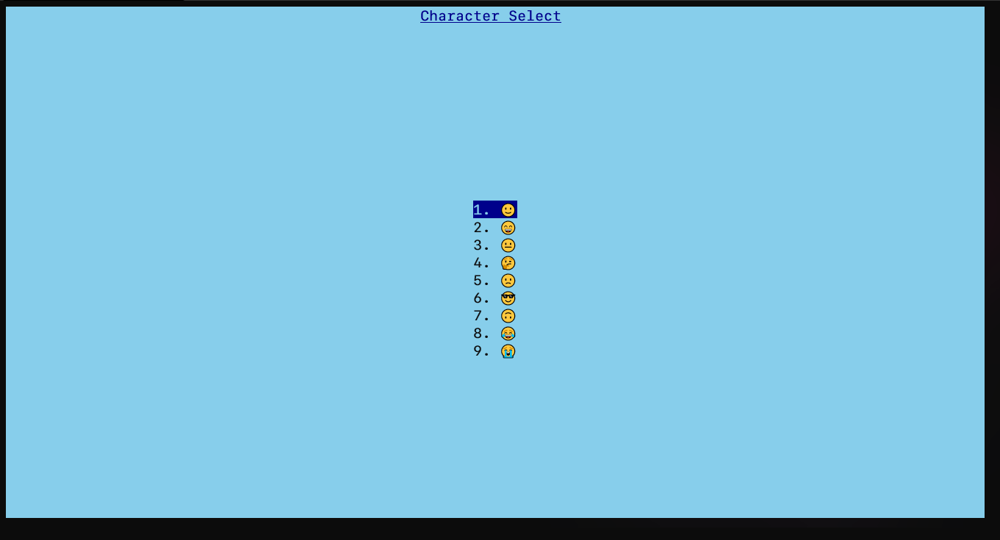
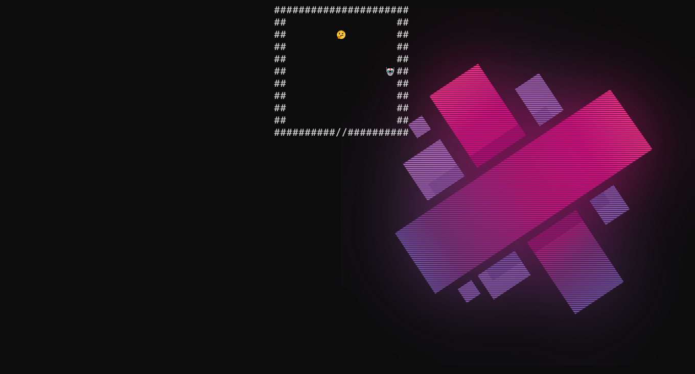
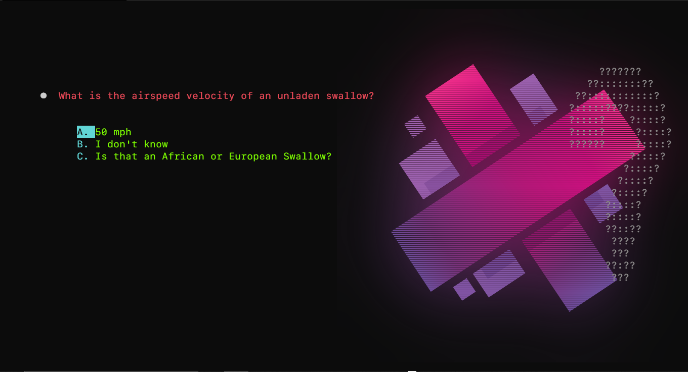

# Think Inside The Box

## Getting started

***



### Install the Poetry Package Manager

***

To run the game first install the [Poetry package manager](https://python-poetry.org/docs/) to automatically manage dependant packages.

### Clone/Download the repository

***

Clone or [Download](https://github.com/Mature-Magpies/think-inside-the-box/archive/refs/heads/main.zip) this repository and navigate to the repository's root directory to install the game's dependant packages with poetry with the following command:

```poetry install```

### Running the game

***

Now you will able to start the game by using the following command:

```poetry run python main.py```

**Note for Windows users:**
*Command Prompt does not render the game properly, please use PowerShell or similar Command Line Interface instead*

## Application Overview

***

### Start Menu

***



#### Menu Interaction

You can interact with the menu options by either entering the **corresponding number** beside the menu option you want to select or use the **Arrow/WASD keys** to move the highlighted selector to the option you want to select and press enter to select it.

The Start Menu is the first screen in the game, It gives three options:

 1. Play
 2. Character Select
 3. Quit

#### Play Option

This option allows you to play, if you don’t select a different emoji character it will use the default which is 🙂.

#### Character Select Option



This option brings you into another menu to choose a character from a list of 9 emojis:

 1. 🙂
 2. 😄
 3. 😐
 4. 🤔
 5. 🙁
 6. 😎
 7. 🙃
 8. 😂
 9. 😭

After you enter a choice it will return you to the main menu to allow you to play with the selected character.

#### Quit Option

This option will quit the game.

**Note:** *You can also use the Ctrl+C shortcut to exit the game at any point.*

### Game World

***



The game world is a maze built procedurally each time the game is run by tessellating prebuilt rooms. The player must make their way from the top room of the maze to the bottom; navigating the rooms and interacting with the None Player Characters (NPCs).

#### Room Navigation

Rooms are made up of 11 by 11 tiles. These tiles can be one of 3 things: A space ``(displayed as '  ' in a room)``, a wall ``('##')`` or a door ``('//')``.
Spaces and doors act in a similar manner; they allow entities to pass through/over them.
Walls prevent players and NPCs from moving over them.
To enter an adjacent room, the player must land on a door at one of the edges of a room.
Rooms can be navigated using the **Arrow Keys (Up, Down, Left and Right)**.

#### NPC Interaction

To interact with an NPC use the Tab key. This will open the [question screen](#Question-Screen).

### Question Screen

*** 



During an encounter with an NPC, you will be presented with a randomly selected question. \
Use the **Arrow Keys (Up and Down)** to select your answer and press **Enter** to confirm. \
If you answered correctly, congratulations! The NPC will move out of the way to let you progress in the [overworld](#Game-World). \
However, if your answer is incorrect, you will be sent back to the beginning of the dungeon!

## Altering Game Files

***

### Adding or Changing Room Layouts

***

Additional Room layouts can be added by editing the room_templates.json file located in the src/GameObjects directory.

Room layouts are organised into 5 main categories:

1. dead-end: Room has only one entrance and exit.
2. straight: Room has two exits - each at opposite edges of the room.
3. corner: Room has two exits - exits are adjacent to one another.
4. 3-way-junction: Room has 3 exits.
5. 4-way-junction: Room has 4 exits.

Style guide: Room entrances follow a standard layout of priority for their entrances:

- The use of non-aesthetic doors must correspond to the category in which the room was placed.
- First entrance without a entrance adjacent anticlockwise is placed at the top.
- All subsequent entrances are then placed around the sides in a clockwise fashion. *Exceptions to this rule are*:
  - straight: entrances are opposite and therefore fully reversible.
  - 4-way-junction: has all 4 entrances and therefore no default orientation.

While doors can be placed on any space in the grid, it is recommended that non-aesthetic doors along the edges of rooms remain centred (for consistency).

Rooms are stored in the following format:

```json
{
    "name":"room_name",
    "Layout": ["<2D array of 11×11 size>"]
}
```

For playability, corridors along the edges of rooms must have double-space width to prevent NPC characters from blocking the way.
In addition, entrances must have an empty space of at least 3×2 in front (to prevent edge cases where after entering, the player gets trapped in a corner by the NPC)

### Adding or Changing Questions

***

Additional Questions can be added by editing the `questions.json` file located in the *src/res* directory.

Each question is represented as a dictionary with the following keys:
 - `id`: A unique string to identify the question within the engine (for example, we can filter out math questions by looking for the 'math-' prefix in their ID.)
 - `prompt`: The question's prompt, i.e. the question that the player will have to answer.
 - `choices`: A list of possible options. Technically, you could add up to 26 different options (one for each letter in the alphabet).
 - `correct`: The index of the correct answer in the choices list, starting at 0.

```json
{
    "id": "readme-demo",
    "prompt": "Did you understand how questions work?",
    "choices": [
      "No",
      "Yes",
      "Perhaps"
    ],
    "correct": 1
}
```

### Changing Object Representation

***

The game can be 're-skinned' through the editing of the object_representation.json in the src/GameObjects directory. All but the player character can be re-skinned (the player can now be customised through the in-game menu at the start of the game).
All objects must have a width of two unicode characters.
The door object has two states: unlocked and locked, hence it has two representations in the json file - unlocked first, locked second.
NPC character representations are randomly selected at initialisation from the NPC array.
